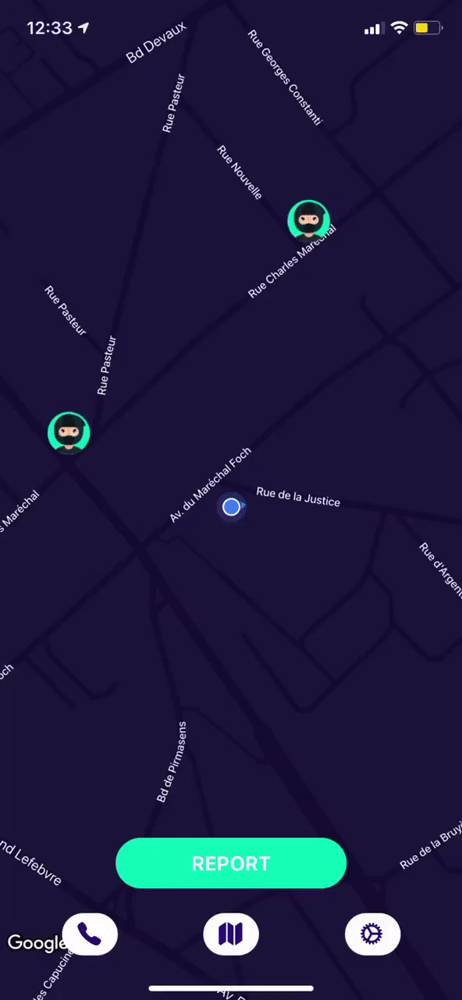
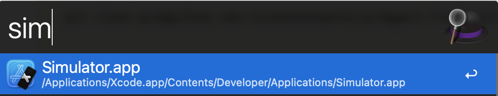
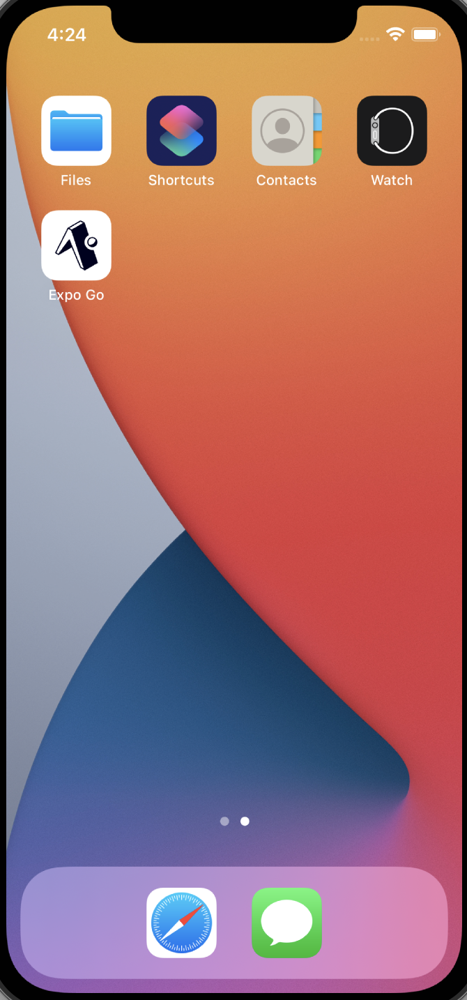
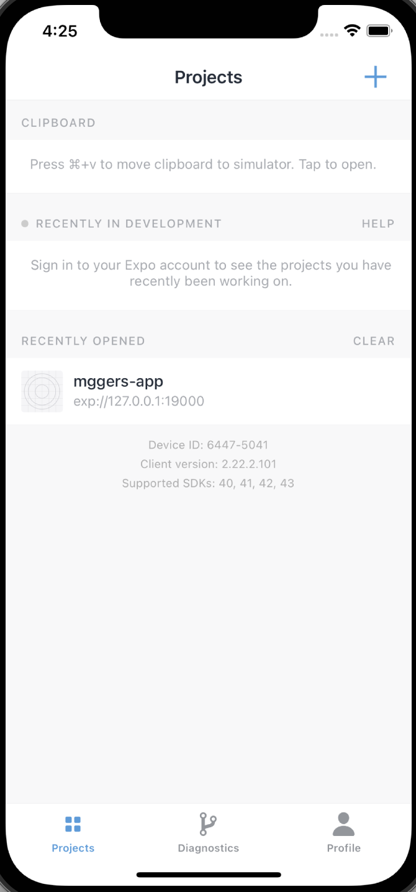
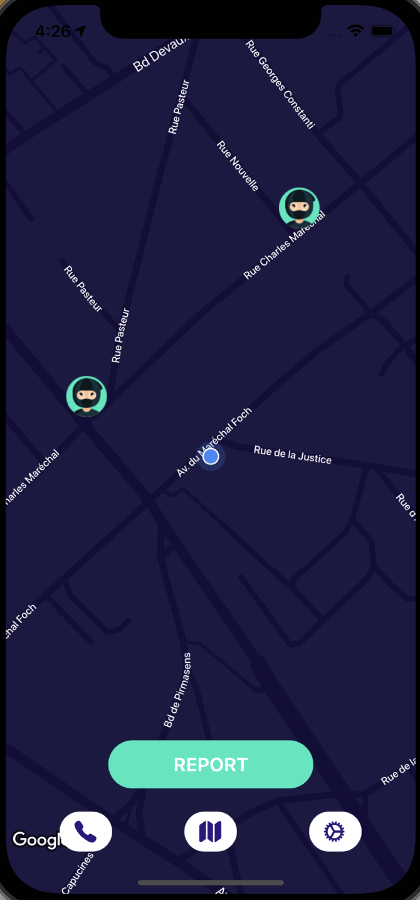

# mggers-front

Mobile application to report muggers and dangers, find nearest police stations and medical cares

### App Demo



### Problematic

There is actually two main problematics here:

- First, when a crime occurs, for example a mugger took your wallet. We take way too long to contact the police, because
  we don’t know where the nearest police station is. So we call the general police number (911, 112, 17) that then
  redirects the information to the nearest police station I guess.

  So a first solution, is to be able to contact directly the nearest police station.

- Second, after you got robbed or something like that, the mugger goes away, you cannot catch him. That same robber can
  be seen by anyone in the area or in a worst case scenario he could attack another person near you.

  A solution for this would be to be able to report that mugger, with a possible description.

### Features

- Display a map with the current user position.
- The map should include the nearest police stations and their contact.
- Also a button to report a mugger at your current position.
- Bonus Feature:
    - Be able to submit a draw of the mugger

### Launch app

Prerequisites:

- Expo cli
- Yarn

```bash
git clone https://github.com/lucasnevespereira/mggers-front.git
```

Install dependeciens

```bash
yarn install
```

Start app

```bash
expo start
```

Go to  http://localhost:19002 and choose run in IOS simulator.

⚠️ If a simulator does not open try to open the simulator before expo start.

<div style="margin-bottom: 10px">
  
</div>

<br />

Once you have the simulator open **Expo Go** and launch the **mggers-app**

<div style="display:flex; gap: 15px;">
  
  
  
</div>


